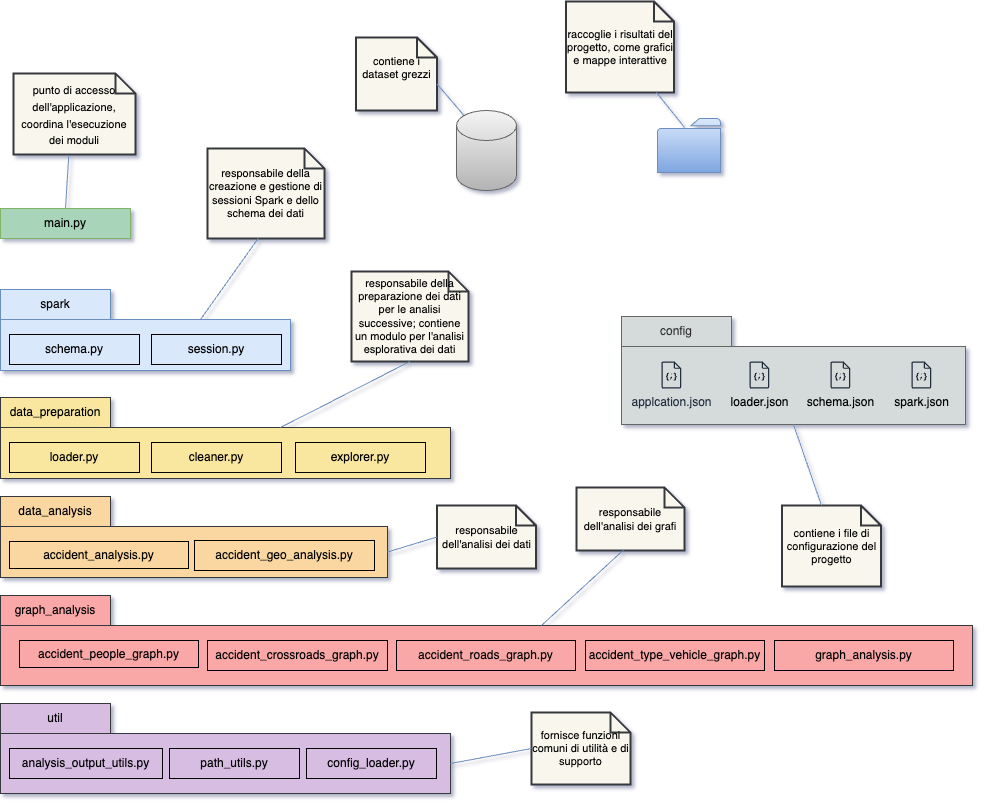
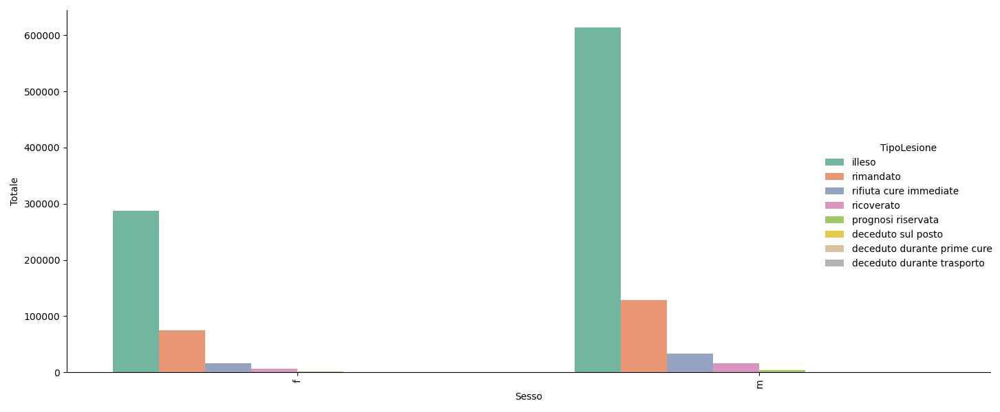
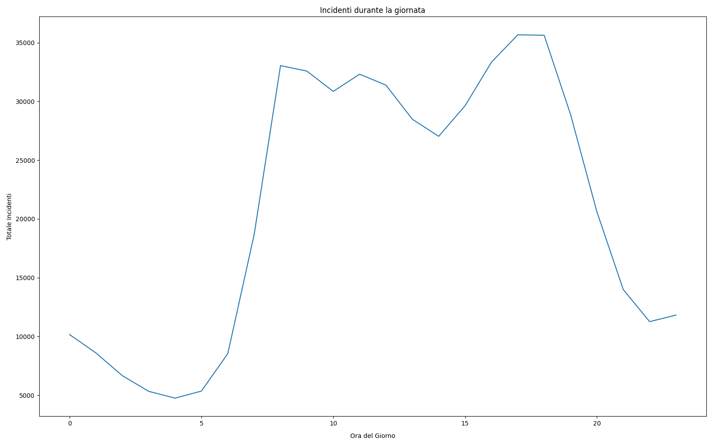
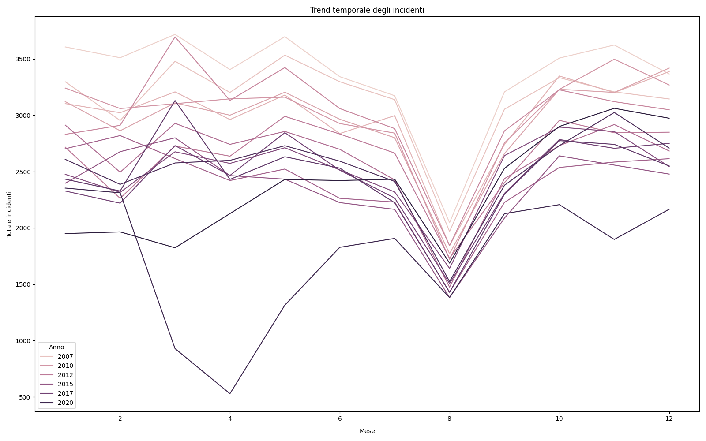
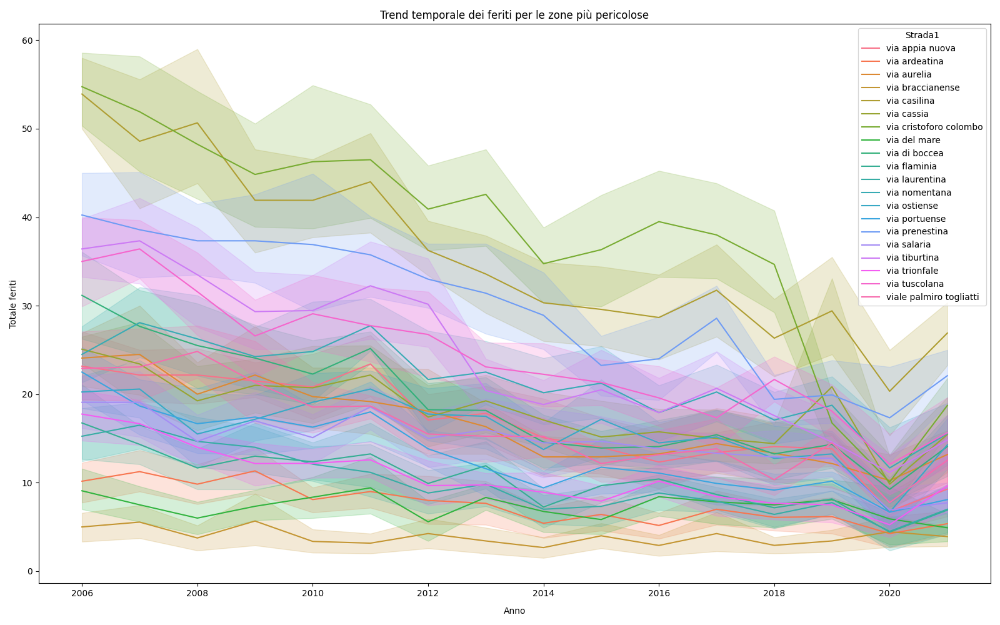

# Big Data: Analisi dei dati degli incidenti stradali a Roma (2006 - 2021)

Questo repository contiene un progetto Python modulare che analizza dataset di incidenti stradali. Il progetto è stato sviluppato come parte del Master di primo livello in Data Science presso l'Università di Tor Vergata Roma.

**M.Ferri, D.Napoli**

## Panoramica

Il progetto analizza gli incidenti stradali nel territorio di Roma Capitale dal 2006 al 2021. L'obiettivo è fornire informazioni utili e oggettive ai decisori politici per migliorare la sicurezza stradale. L'analisi identifica le strade e le aree a maggior rischio e con più vittime. I dati storici permettono inoltre di rilevare tendenze significative nel tempo. Utilizza un approccio modulare con vari package per facilitare l'analisi e la generazione di grafici.

  

## Esempi di grafici

Alcuni esempi di grafici generati dal progetto:

  
  
  
  

## Dataset

Sono stati utilizzati i dataset resi disponibili sul portale open data del Comune di Roma: 
[Dataset incidenti stradali](https://dati.comune.roma.it/catalog/organization/roma-capitale-area-tematica-supporto-all-amministrazione)

Ogni dataset include gli incidenti stradali avvenuti nel territorio di Roma Capitale nell'anno di riferimento, registrati dall'intervento di pattuglie della Polizia Locale di Roma Capitale. Sono esclusi gli incidenti risolti con conciliazione tra le parti coinvolte e quelli verificatisi sul Grande Raccordo Anulare.

### Documentazione del Progetto

Nella cartella `docs` è presente tutta la documentazione del progetto. Qui troverai i risultati restituiti dall'applicazione, come stampe della console, grafici e altro. Per scaricare la presentazione del progetto, usa [questo link](docs/report/RomeAccidentAnalysisPresentation.pptx).

## Licenza

Questo progetto è licenziato sotto la licenza MIT. Vedi il file [LICENSE](LICENSE) per ulteriori dettagli.

---

